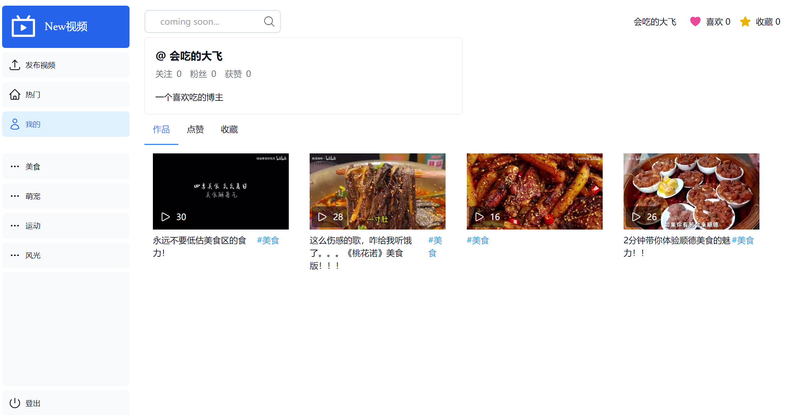
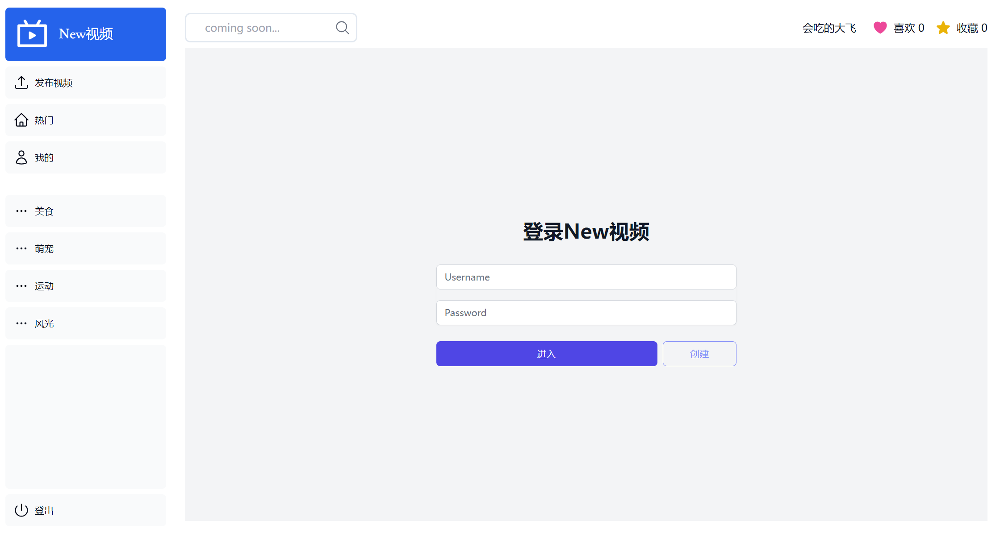
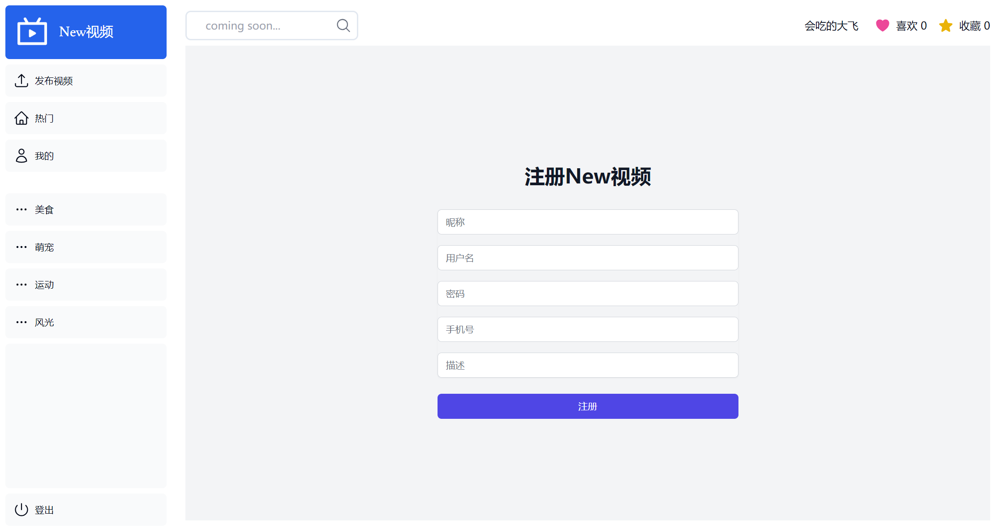
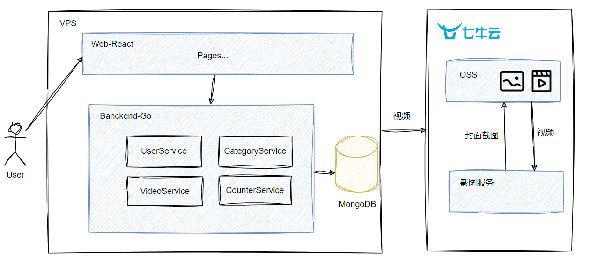

# New 视频

<br />
<p align="center">
  <a href="https://github.com/chajiuqqq/qiniu-1024/" target="_blank">
    
  </a>
  New视频
</p>

<p align="center">
<a href="http://47.106.228.5:8080/new-video.mp4" target="_blank">
    演示视频 
  </a>
  |
  <a href="http://47.106.228.5:3000/" target="_blank">
    Demo
  </a>
  </p>

**New 视频是一款使用七牛云 OSS 实现视频存储的 Web 端短视频网站，用户可以自由注册登录，浏览不同分类的视频，也可以上传自己的视频成为博主哦。**

# 特点

- 视频上传，自动生成封面
- 视频播放，暂停，进度拖动
- 视频点赞，收藏
- 用户注册、登录
- 视频分类浏览

<div align="center">
        
</div>

# 上手指南

下载源码：

```
    git clone https://github.com/chajiuqqq/qiniu-1024.git
```

自行安装依赖：

- go >= 1.21.0
- node.js >= 18
- MongoDB

**开发环境启动步骤：**

- Go：
  - 进入 server/cmd/api，修改 local.yaml，配置好 mongodb
  - 当前目录下运行 `go run .`，默认使用 local.yaml 作为配置文件
- Web：
  - 进入 web/
  - 运行 npm i，安装依赖
  - 进入 app/lib/api/api-client.js，修改 go 后端 Endpoint 地址
  - 在 web 下运行`npm run dev`启动项目，在:3000 端口查看界面

**容器部署步骤：**

- 修改 docker-compose.yml 中的挂载卷，在 conf 文件夹下建立 config.yaml,内容可以复制 local.yaml，并配置好 MongoDB 的地址
- 在根目录下执行`docker compose up`
- 访问 http://localhost:3000/

## 界面展示

<div align="center">
    <div>
        
        <p>个人详情</p>   
        
        <p>发布</p>   
    </div>
    <div>
        
        <p>分类页</p>   
    </div>
    <div>
        
        <p>登录</p> 
        
        <p>注册</p>
    </div>
</div>

## 演示视频

[演示视频](http://47.106.228.5:8080/new-video.mp4)

# 项目结构

## 目录结构

```
root
|──server //go项目
|   ├─cmd
|    │  └─api // 程序入口
|    ├─model // 数据库模型
|    ├─service //业务层
|    ├─types //前端交互类型
|    └─utils // 工具类
|        ├─oss
|        ├─shared
|        ├─xecho
|        ├─xerr
|        ├─xlog
|        └─xmongo
|——web // 前端项目
    ├─app // nextjs的页面入口，包含各类页面
    └─public // 静态文件目录
```

## 系统结构



## 模块设计

| 模块       | 说明                                                                                                                                   | 工时 |
| ---------- | -------------------------------------------------------------------------------------------------------------------------------------- | ---- |
| 视频模块   | 1. 视频列表拉取(视频状态的获取，用户对视频的互动记录获取（是否点过赞、是否收藏、是否关注)) 2. 视频播放、暂停、切换 3. 上传视频（文案） | 1+1  |
| 分类模块   | 热门、体育。。。                                                                                                                       | 0.5  |
| 用户模块   | 1. 注册（头像，名称，手机号,描述） 2. 登陆 3. 查看我的视频                                                                             | 1+1  |
| 互动模块   | 1. 点赞 2. 收藏                                                                                                                        | 1+1  |
| 中心化框架 | mongodb & OSS SDK ; echo 的中间件（JWT、错误处理、日志 zap） ; Api 和 web 的部署                                                       | 2 天 |

## 技术栈

后端 Web 框架：Echo

数据库：MongoDB

前端：

- Next.js
- TypeScript
- TailWind CSS
- Plyr 播放组件

# 团队分工

独立开发 Chris.Cai(chajiuqqq@gmail.com)

# 致谢

- [Next.js](https://nextjs.org/)
- [React](https://zh-hans.react.dev/learn)
- [ChatGPT](https://chat.openai.com/)
